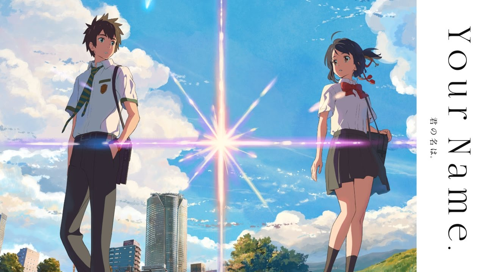

AKA the one anime I watched each year.

## 2010: Katanagatari

It's been a while since I watched this. The biggest standouts were the sharp art style, hype music, and memorable main characters. I'll never forget those final two episodes. It's one of the few shows with high stakes battles. Worth it for the stylized art direction alone.

## 2011: Steins;Gate

Time travel is my favorite trope, so this one's a no brainer.

Rintaro Okabe's esoteric team can be grating to some people, but it only makes the contrast of the second half even starker. This juxtaposition of comedy and despair will be copied by countless shows that come after.

## 2012: Psycho-Pass

Sci-fi dystopias are another one of my favorite tropes.

Psycho-Pass is basically a darker minority report. It's brutal and doesn't pull any punches. I like how the villain actually poses a threat to the protagonists and pushes them to their limits. The losses they suffer aren't superficial either.

### 2012 Runner Up: Fate/Zero, Season 2

_Fate/Zero_ really picks up steam after all the characters and motivations have been set up. _Fate/Zero_'s protagonist, Kiritsugu Emiya, is literally that guy who says, "If this was real life, I would do [X] instead of [Y]." He's such an edge lord, but I love his brutal battlefield tactics.

He's contrasted by Saber, the idealist, and it does a lot to set up her character for _Unlimited Blade Works_. I always love when there are two main characters with opposing viewpoints.

## 2013: Wolf Children

I remember watching this with my mom, and she cried the entire time. A story about a single mother raising two eponymous wolf children probably hits parents even harder.

Mamoru Hosoda is an expert at balancing the whimsical and fantastical elements with universal themes.

## 2014: Love Live! School Idol Project, Season 2

I never wanted to watch this show because I thought only creeps and girls were into _Love Live_. I don't remember why, but I eventually started watching it while working out. It was when I was obese, and seeing these nine girls doing their best to achieve their dreams motivated me to go work out every night until I finished the entire series.

The final episodes and throwbacks to season one were truly incredible. Some of the songs were a little nasally for me, but there were some real bangers like _Snow Halation_ and _START:DASH!!_ (never forget). 

## 2015: Fate/stay night: Unlimited Blade Works, Season 2

Ufotable's animation is always incredible. And with the story largely set up in season 1, they're able to barrel toward the thrilling conclusion. For those who haven't the seen the terrible movie, I envy them for being able to experience one of the greatest twists. Some may disagree with me, but it's one of my favorite tropes.

### 2015 Honorable Mention: Food Wars!

I didn't actually watch this until recently, but I have to give _Food Wars!_ a shout-out for being really out there with the anime tropes but still being accessible to the general audience. Just... don't watch it with your parents or kids.

Nicole, being a foodie, wanted to watch this, and it was one of the early gateway anime to get her to watch more with me.

## 2016: ERASED

Time travel _and_ a murder mystery? It's like this show was made for me. _ERASED_ is one of the greatest thrillers I've ever seen. The tension gets almost overbearing as you wonder how some elementary school kids will thwart a serial killer. Even if you guess who the killer is, the premise doesn't allow for an easy out. You're stuck watching the tragedy unfold alonside Satoru.

### 2016 Runner Up: My Hero Academia

_My Hero Academia_ is an extremely fun ride with an uplifting theme. Even so, the stakes in this show are real. People die, and heroes are seriously injured or permanently disfigured. The highs of this show surpass the MCU for me, because the fights have context; they're usually against other heroes or individual villains instead of hordes of CGI monsters.

This was a tough choice, but the consistently high quality and tight story telling for _ERASED_ won out for me. As a shonen show, _My Hero Academia_ does have a lot of recap and wasted moments, unfortunately.

## 2017: Your Name

I watched _Your Name_ at least 4 times in theaters, and I noticed something new every single time.

This movie is a masterclass in editing. The way scenes are cut together serve to set up the premise, convey how Taki and Mitsuha feel, and throw the viewer off the scent. 😉

The plot is fantastical, yes, but it's woven tightly. There's never a dull moment here when each scene is bursting with foreshadowing and beautiful imagery. 

Before this movie, I thought Shinkai was hugely overrated and that there was no way this movie would live up to the hype. But it totally did and then some.

### 2017 Honorable Mention #1: Miss Kobayashi's Dragon Maid

This is such a sweet slice-of-life, comedy show. Despite the eclectic cast of mythological dragons, the show remains very grounded. It's more about character interactions than anything.

The standout moment was when I accidentally started watching episode 4 as my first episode. Kanna wanted to go to elementary school and was shopping for school supplies. She wanted a cute keychain but noticed Kobayashi commenting she didn't have enough money and to put it on her card. Kanna saw this and put the keychain back. Just... so precious. 😭😭😭

### 2017 Honorable Mention #2: Recovery of an MMO Junkie

Another slice-of-life show that's super relatable. 2017 seems to be the year of adult-oriented shows with Kobayashi being a software engineer, and Morimori (from _Recovery of an MMO Junkie_) being a victim of burnout and workplace harassment.

It's a sweet show about finding an escape in video games but also coming to terms with reality.

## 2018: My Hero Academia, Season 3

I'm so used to shonen shows not dealing with the consequences of the main character's actions. Here, Midoriya's recklessness produces some truly cringe-worthy moments, and it permanently alters his character. That's what made Season 3 of the most memorable shows of all time.

A lot of shonen try to stall out character arcs or meaningful progress, but not _My Hero Academia_. One of the longest standing threads from season one comes to a definitive close, and sets up the next generation of heroes and stories.

## 2019: Shadowbringers 

Does this count?

_Shadowbringers_ is definitely in my top 2 Final Fantasy stories of all time. The way it treats the Warrior of Light as a real character and humanizes the scheming Ascians were two of my biggest complaints about _Final Fantasy XIV_'s story.

Emet-Selch is one of the greatest villains in Final Fantasy history, and I hope other writers learn from Natsuko Ishikawa or that she gets her own game to write.

## Anime of the Decade: Your Name

🎉🎉🎉

No surprise here. This is the movie/show I've rewatched the most and wholeheartedly recommend to everyone. Once again, incredible directing, editing, music, just everything about this movie is nearly perfect. I absolutely adore the story. It has my favorite twists and tropes and everything.

Go watch it!

## Final thoughts

This decade really flew by. I definitely watched a lot more in the first half than the second half of the decade. I should really change that because I feel like more good shows are coming out, and more people are watching them.

I look forward to seeing what comes out in the 2020s and the trends that emerge. Please, for the love of God, stop all the isekai shows.
